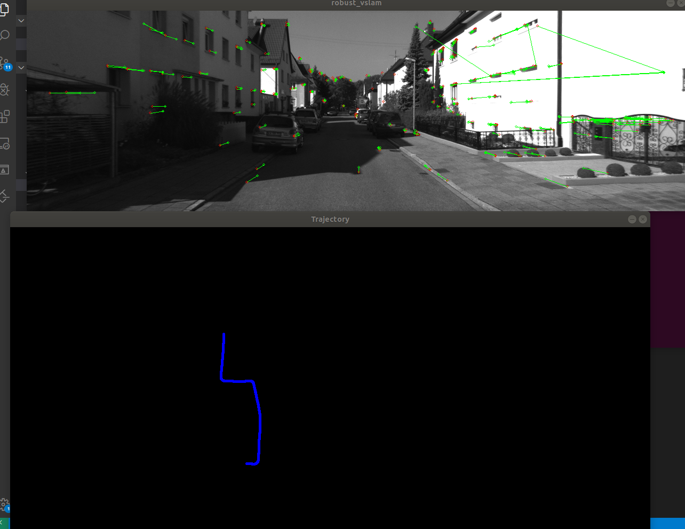

## Stereo-Visual-Odometry 

This is a simple frame to frame visual odometry.

- kitti demo

build step:
```
cd robust-vslam
mkdir build
cd build
cmake ..
make -j2
```
run:

```
./run_kitti_stereo ../config/default.yaml
```
- ROS 

build step:
```
cd robust-vslam/app/ros/robust-vslam
mkdir build
cd build
cmake ..
make -j2
source devel/setup.bash
export ROS_PACKAGE_PATH=${ROS_PACKAGE_PATH}:/home/lzb/Projects/robust-vslam/app/ros/robust-vslam
```
run:

```
cd robust-vslam/app/ros/robust-vslam
./lzb_vio_ros ../../../config/default.yaml
rosbag play xxx.bag
```

FAST Feature detector and LK matching:


orb Feature detector and opencv matching:



